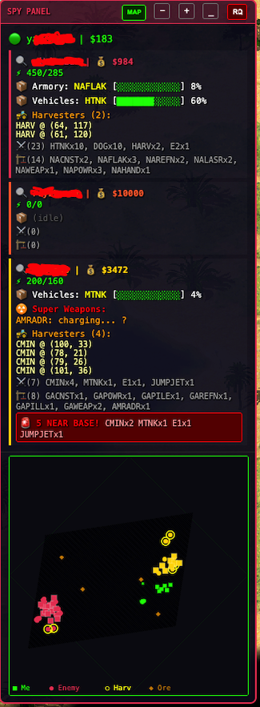
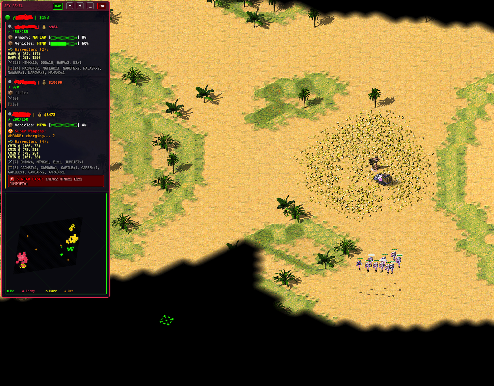

**If you'd like to see more features and find this useful, drop a ⭐ — it helps visibility.**


# ChronoDivide Cheat / Red Alert 2 Online - Spy Panel

> ⚠️ **For educational purposes only.** Demonstrates how browser-based lockstep multiplayer games expose client-side state.

## Preview




## Features

- 💰 Real-time enemy credits
- ⚡ Power status (low power alert)
- 📦 Production queue with progress bars
- 🚜 Harvester positions (coordinates)
- ⚔️ Full army composition
- 🏗️ Building list
- 🚨 Base proximity threat alert
- ☢️ Super weapon status
- 👥 Auto ally/enemy detection
- 🏳️ RQ button — rage quit ranked matches without losing rating
- Supports 1v1, 2v2, FFA

## How it works

ChronoDivide uses lockstep multiplayer — every client runs the full game simulation. All player data exists in memory. This tool reads (never writes) that data and displays it as an overlay. **Zero desync risk.**

## Usage

1. Open [ChronoDivide](https://chronodivide.com) in your browser
2. Open DevTools console (F12)
3. Paste contents of `spy.js`
4. Join/start a game — panel appears top-left

## Installation

```js
// Just paste spy.js contents into browser console
```


---

## More to Come
Planned features for upcoming releases:
- 🏳️ **Safe rage quit** — exit ranked matches without losing rating points (Available now!)
- 🗺️ **Map ESP overlay** — visualize all units, structures and harvesters directly on the in-game map (Available now!)
- 📊 **Player win/loss stats** — track win rates and match history per player
- 🎯 **Unit pathing prediction** — show enemy movement vectors in real-time
- 🔔 **Custom alert system** — configurable triggers for specific units, tech or build orders
- 💾 **Match replay export** — dump captured intel to JSON for post-game analysis
- 🎨 **Themeable UI** — customizable panel layout, colors and opacity

Have an idea? Open an [issue](https://github.com/lordexoc/chronodivide-ra2-spy-panel/issues) or PR.

---

**⭐ If you find this project useful, please leave a star — it really helps with visibility and motivates further development!**
