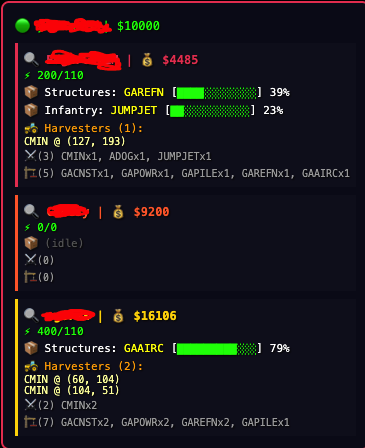
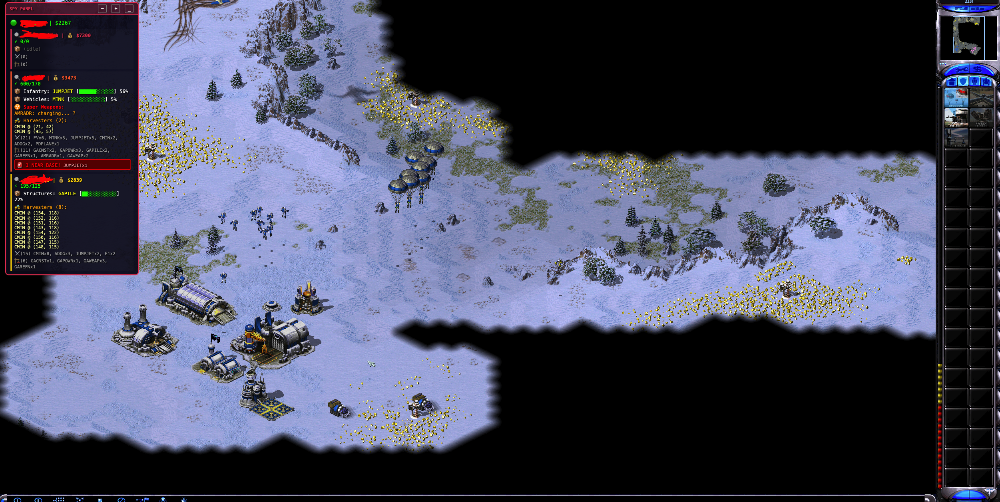

**If you find this useful, drop a ⭐ — it helps visibility.**
**If you'd like to see more features or updates, consider ⭐starring⭐ and following the repository.**


# ChronoDivide Cheat / Red Alert 2 Online - Spy Panel

> ⚠️ **For educational purposes only.** Demonstrates how browser-based lockstep multiplayer games expose client-side state.

## Preview




## Features

- 💰 Real-time enemy credits
- ⚡ Power status (low power alert)
- 📦 Production queue with progress bars
- 🚜 Harvester positions (coordinates)
- ⚔️ Full army composition
- 🏗️ Building list
- 🚨 Base proximity threat alert
- ☢️ Super weapon status
- 👥 Auto ally/enemy detection
- Supports 1v1, 2v2, FFA

## How it works

ChronoDivide uses lockstep multiplayer — every client runs the full game simulation. All player data exists in memory. This tool reads (never writes) that data and displays it as an overlay. **Zero desync risk.**

## Usage

1. Open [ChronoDivide](https://chronodivide.com) in your browser
2. Open DevTools console (F12)
3. Paste contents of `spy.js`
4. Join/start a game — panel appears top-left

## Installation

```js
// Just paste spy.js contents into browser console
